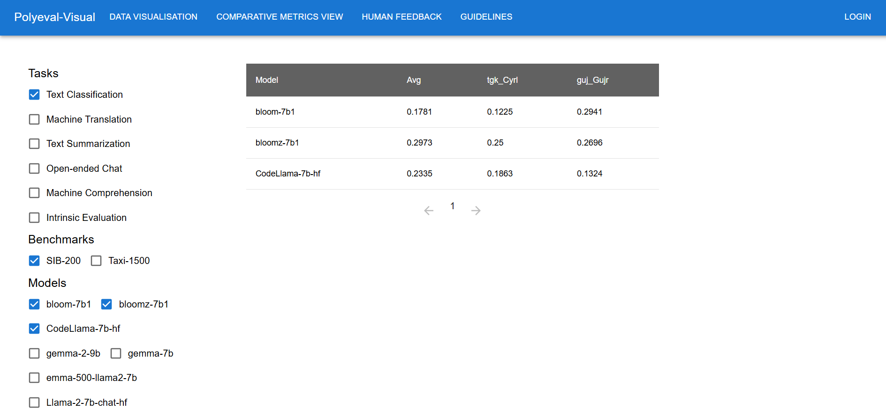
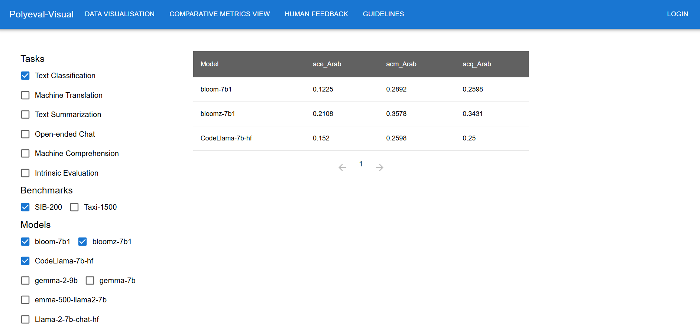
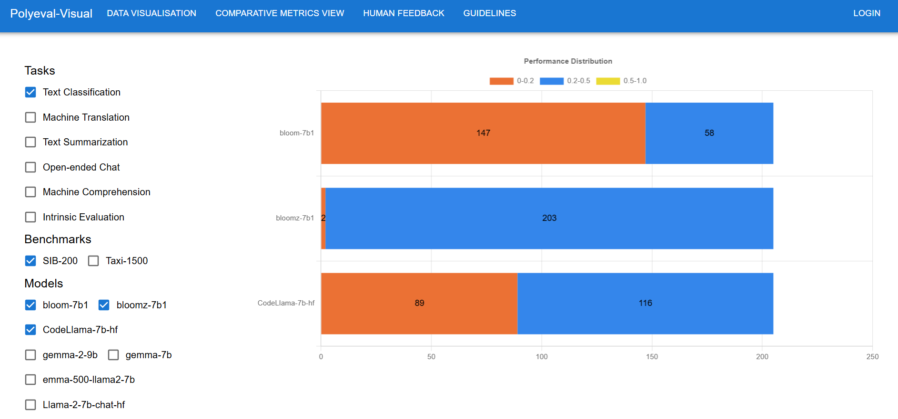
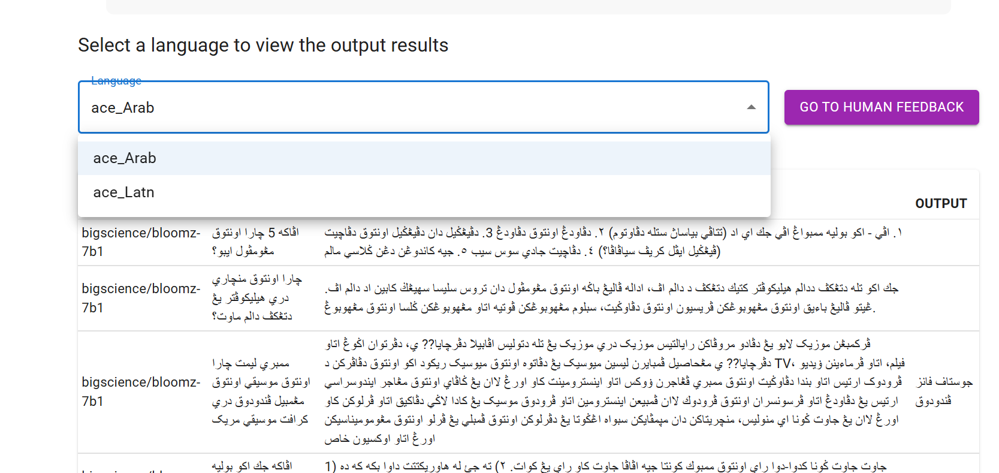
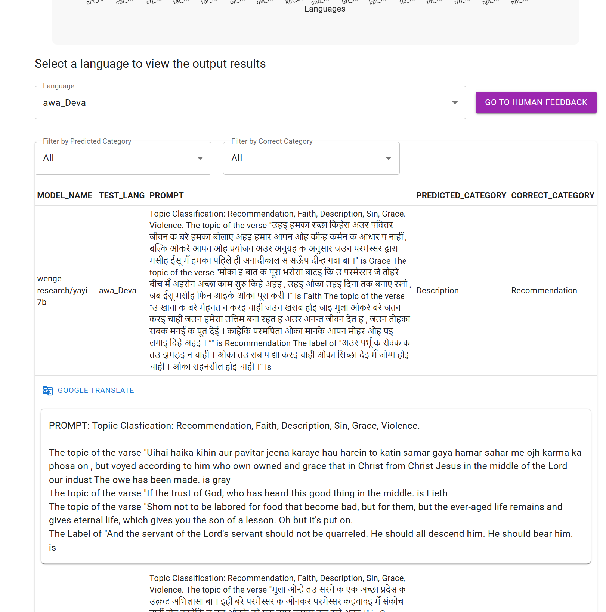
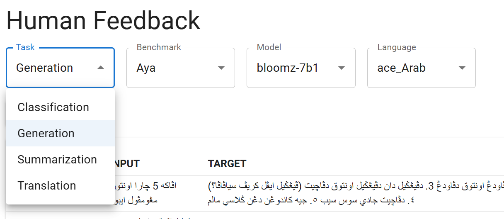
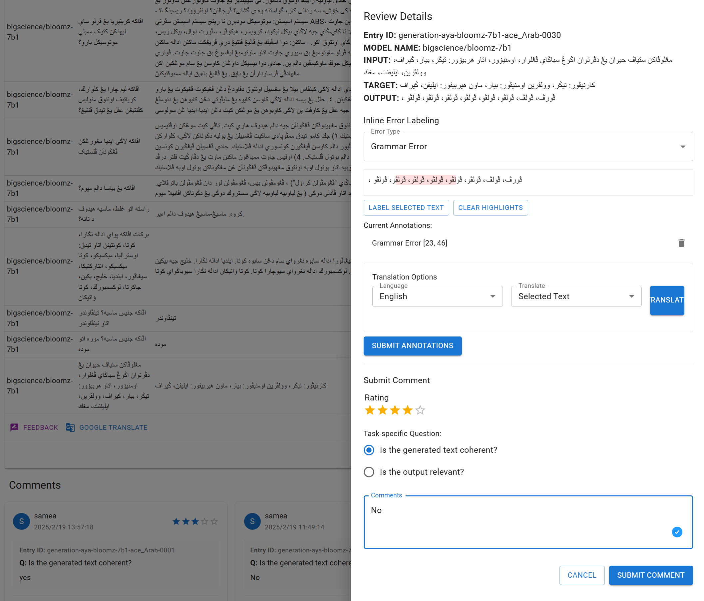
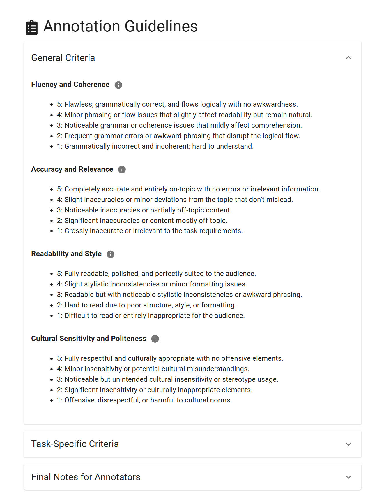

Features
========
Data Visualization
------------------
Data charts
~~~~~~~~~~~~~~~

Comparative Metrics View
~~~~~~~~~~~~~~~~~~~~~~
Under Comparative metrics view, users can able to select a Task, Benchmark, Models, Catrgory, Value and Languages. According to the selection made by the users, evaluation scores for different languages are displayed.

Resources (MALA):
According to MALA classification, languages are divided into High, Medium-High, Medium, Medium-Low, Low, Unseen, etc. according to their resources.

Writing Systems:
Languages are arranged according to their Writing Systems. For example, English, French and German are placed under Latin.

Performance:
Users can able to view results in the form of Bar graphs for Total number of languages that fall under each performance bin of different models according to their evaluation scores.

ResourcesJoshi:
According to Joshi classification, languages are divided into Categories such as Catgory 0, Category 1, Category 2, Category 3, Category 4 and Category 5.

Output Section
~~~~~~~~~~~~~~
Under the language comparison results chart, there is a section that displays **specific output results**.
Selecting a language will reveal all corresponding output results.

By clicking the **"GO TO HUMAN FEEDBACK" button**, you will be redirected to the corresponding human feedback page. 
If no language is selected, a prompt will appear reminding you to choose a language first.

.. note:: The section will only be displayed when the filter type is set to model in the previous step.

Translation and Filters
~~~~~~~~~~~~~~~~~~~~~~
It provides filters and translation functions to assist in result analysis.

- **Translation** - Upon clicking the translation button, the translated text by  Google Translation will be displayed. If no language is detected, a prompt will appear to alert the user.
- **Catergory Filters** - For *classification tasks*, filters for both predicted category and correct category will be provided to facilitate the examination of results.
  

Human Evaluation
------------------
Task seletion
~~~~~~~~~~~~
In the human feedback options, sequentially select the **task type**, **benchmark**, **model**, and **language**, and the corresponding output results will be displayed.

Feedback sidebar
~~~~~~~~~~~~~~~~~~
Clicking on a row will expand it, revealing a feedback button and a translation button within the expanded row.
Clicking the feedback button will cause a feedback sidebar to appear on the right side.

.. note:: The sidebar will only pop up when the user is logged in; otherwise, a login reminder will be displayed.

The feedback sidebar allows users to provide feedback on the model's predictions. 
It includes a text box for users to enter their feedback and a button to submit the feedback. 
The feedback will be stored in the database and can be accessed later for further analysis.

Highlighter
~~~~~~~~~~~~

Guidelines
~~~~~~~~~~~~

